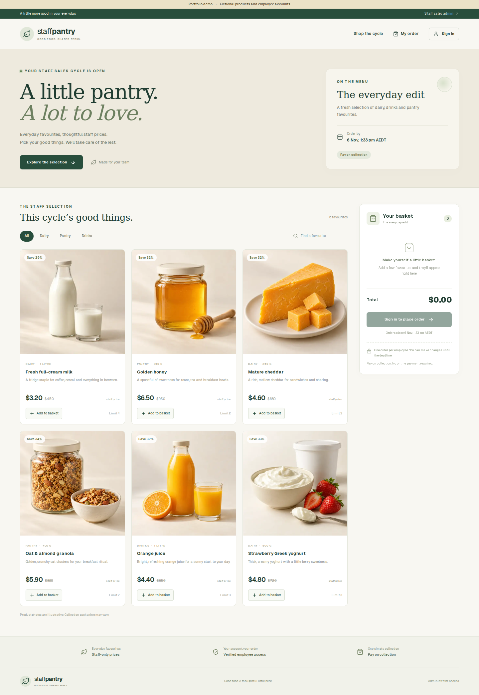

# Staff Pantry — Employee Order System

A staff food ordering application built with Next.js, TypeScript, Prisma and SQLite/libSQL. Employees browse a sales cycle, sign in with an administrator-provisioned account, and place or edit their own order before the deadline. Administrators manage accounts, products, cycles and PDF fulfilment exports.



## What the project demonstrates

- Employee and administrator credentials authentication with bcrypt hashes, separate roles and eight-hour sessions.
- Server-side ownership checks: employee identity comes from the authenticated account, never from the request body.
- Fresh account checks and session revocation after an employee's details, passcode or active status change.
- Persistent sign-in throttling, same-origin mutation checks and strict Zod request validation.
- Transactional ordering, exact decimal totals, atomic order numbering, per-product limits and one order per employee per cycle.
- Dynamic catalogue and order pages that respect cycle status, start time, product availability and deadlines.
- A responsive catalogue with search, category filters, quantity controls, savings, a basket and clear confirmation.
- Six original AI-generated, unbranded food photographs. See [asset prompts](docs/product-images.md).
- Admin catalogue and account management, cycle controls, historical orders, summary and individual PDF exports.
- A guarded synthetic demo seed, unit tests, API integration tests, browser tests and GitHub Actions checks.

Prices are displayed in Australian dollars. Orders are collected and paid for through the organisation's existing process; the application does not process payments. A verified sign-in records account ownership, rather than a legal electronic signature. Older orders retain their historical signature requirement.

## Local setup

Use Node.js 24 (see `.nvmrc`).

```bash
npm ci
cp .env.example .env
```

Set a unique `AUTH_SECRET` in `.env`:

```bash
node -e "console.log(require('node:crypto').randomBytes(32).toString('hex'))"
```

Keep `AUTH_URL=http://localhost:3000` for local development. Set `DATABASE_URL=file:./dev.db`, then run:

```bash
npm run db:deploy
```

Set `ADMIN_USERNAME`, `ADMIN_PASSWORD` and optionally `ADMIN_NAME` in `.env`. Passwords and employee passcodes must contain 8–72 printable ASCII characters; choose a long, unique value. There is no built-in administrator password. The old `admin123` password is explicitly rejected.

```bash
npm run db:admin
npm run dev
```

Visit `/admin` to add employees and private passcodes, create products, add them to a draft cycle, set a future deadline and open it. Only one cycle can be open. Employees can browse without signing in, but must sign in to submit or edit an order.

## Portfolio demonstration

Use a **separate empty database** for the public portfolio demo. Never seed a workplace database or copy employee/order records into a public demonstration.

Set these values in `.env`, choosing disposable demo passwords:

```dotenv
DATABASE_URL=file:./pantry-demo.db
DEMO_MODE=true
ALLOW_DEMO_SEED=true
DEMO_EMPLOYEE_ID=DEMO001
DEMO_EMPLOYEE_PASSWORD=your-demo-passcode
DEMO_ADMIN_USERNAME=demo-admin
DEMO_ADMIN_PASSWORD=your-demo-admin-password
```

```bash
npm run db:deploy
npm run db:seed-demo
npm run dev
```

The seed creates six unbranded products, a 30-day sales cycle and three fictional employees. `DEMO_MODE=true` displays a visible demo banner and the synthetic employee credentials. Administrator credentials are not displayed. The seed refuses to mix its records with an existing business catalogue. It is idempotent and does not overwrite existing passcodes or reopen expired cycles. After seeding, set `ALLOW_DEMO_SEED=false`.

A public demo shares its fictional employee account and therefore its fictional orders with visitors. Keep administrator access private, and reset the isolated demo database periodically or provide a fresh demo cycle as appropriate. The seed is a demonstration workflow, not evidence of real sales.

## Upgrading an existing installation

1. Back up the database and check its `_prisma_migrations` history. Configure `DATABASE_URL` to point to that same persistent database.
2. Run `npm ci` and `npm run db:deploy`. The migration keeps employees and order history, adds session versions and an order counter, clears all previous product image references, and allows only the most recent previously open cycle to remain open. The deploy command also removes the legacy `public/uploads/products` directory.
3. Replace any legacy administrator password using `ADMIN_RESET_PASSWORD=true npm run db:admin` with the desired username/password in the environment, then remove those provisioning variables. This revokes earlier administrator sessions.
4. Use the admin employee editor to provision new passcodes for staff with missing or short legacy PINs. Employee edits revoke existing sessions.
5. Assign the new unbranded photos, categories and pack sizes in the catalogue editor. Review cycle products, prices and deadlines before reopening ordering.

The SQL migrations are applied by the included SQLite/libSQL runner, which records and verifies the standard Prisma migration checksums. A database made with `prisma db push` but without migration history needs an explicit baseline before deployment; do not apply the initial migration over existing tables.

## Free portfolio hosting

A prepared Vercel Hobby + Turso Free deployment is documented in [the portfolio deployment guide](docs/portfolio-deployment.md). First-time setup checks the database before migrations or seeding and accepts Turso Marketplace environment variables. Normal redeployments compile without touching the database; future schema changes use the guarded `npm run db:prepare-demo` command before deploying. This configuration is for a separate personal demo project.

## Persistent hosting

Production requires an explicit `DATABASE_URL`, a unique `AUTH_SECRET`, HTTPS and an `AUTH_URL` matching the public origin. Set `APP_TIMEZONE` to your organisation's IANA timezone. Employee and administrator sign-in use the same origin. Do not place the SQLite database on an ephemeral or read-only application filesystem.

Two supported storage approaches:

- A single application instance with SQLite on a persistent volume. The supplied Docker Compose configuration stores the database in the `pantry-data` volume.
- Hosted libSQL: set `DATABASE_URL=libsql://your-database-host` and `DATABASE_AUTH_TOKEN`. Apply migrations against that database before starting the application.

For Docker, set `AUTH_URL` and `AUTH_SECRET` in `.env`, then:

```bash
docker compose up --build -d
docker compose run --rm setup npm run db:admin
```

The first setup service migrates the persistent database before the web service starts. Place the web service behind HTTPS, retain the database volume across releases, and make regular database backups. Do not run local SQLite with several independent application replicas. Product photos are bundled static WebP assets; no writable upload directory is required.

The Docker runner uses Next.js standalone output. For a conventional Node host, `npm run build` then `npm run start` starts the app; Next.js may print its standalone-output notice. A standalone host must copy `public` and `.next/static` alongside `.next/standalone/server.js`, as the Dockerfile does.

## Verification

```bash
npm run lint
npm test
npm run build
npm run test:integration
npx playwright install chromium
npm run test:e2e
npm audit
```

Integration and browser tests automatically create isolated SQLite fixtures under `.test-data`; they do not use the configured workplace database. The API tests cover forged identities, cross-owner edits, guest access, invalid quantities, duplicate lines, concurrency, expired/closed cycles, account revocation and throttling. Browser tests cover catalogue filtering, employee checkout/editing, mobile overflow, admin cycle control, image selection and PDF downloads.

## Scope and limitations

This project is suitable for demonstrating an internal ordering workflow and its engineering improvements. It is not a payment gateway, inventory stock reservation system, email delivery system or an independently audited authentication service. Administrators provision and reset accounts; there is no self-service account recovery or MFA. Generated food photos are illustrative and do not represent an actual packaged product.

No real employee data, workplace branding or credentials should be included in a portfolio deployment.
